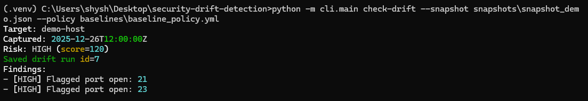
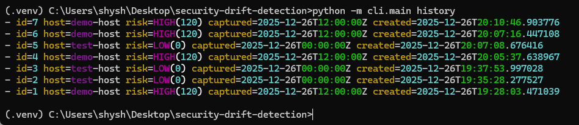
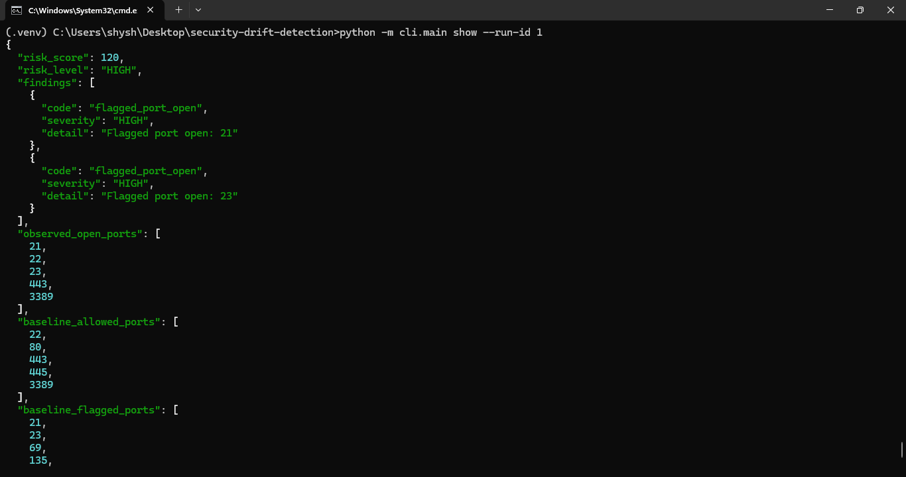
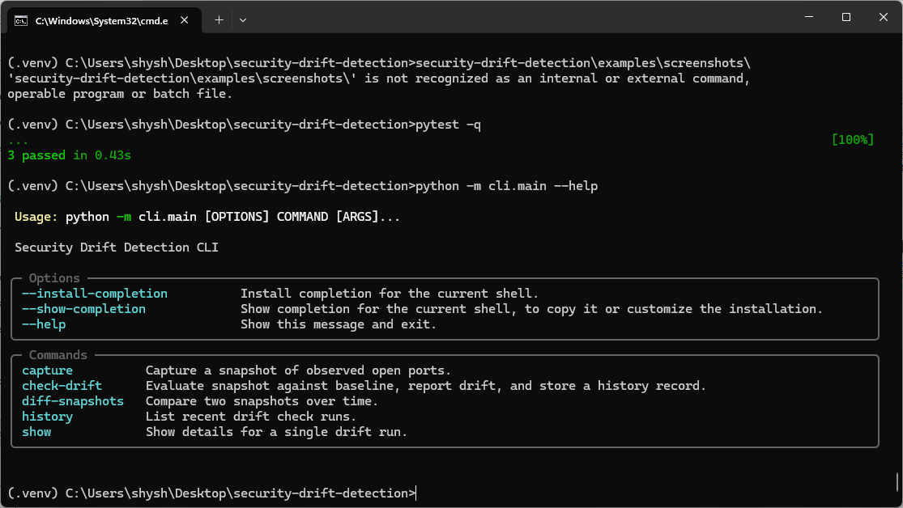
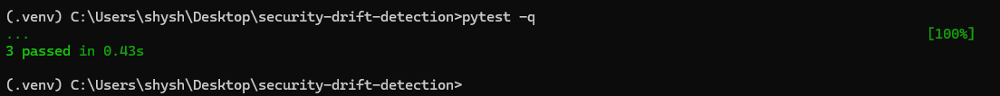

# Security Drift Detection

**Security Drift Detection** is a Python-based cybersecurity tool that identifies when systems deviate from approved security baselines over time. It captures infrastructure snapshots, evaluates drift against policy, assigns risk severity, and stores results in an audit-ready history.

Built for **authorized, non-disruptive use** in enterprise, manufacturing, and regulated environments.

🔗 Repository: https://github.com/Ambitiousways/security-drift-detection

---

## Why this matters

Many security incidents are not caused by new vulnerabilities — they happen because environments **drift**:

- Temporary changes are never reverted  
- Legacy services get re-enabled  
- Ports reopen after updates or troubleshooting  
- Baseline hardening weakens over time  

This tool helps teams answer:

> **What changed, when did it change, and why does it matter?**

It is designed to support **security operations, audits, and remediation workflows**, not exploitation.

---

## What the tool does

- Captures snapshots of observed open ports (authorized scanning)
- Validates snapshots against an approved baseline policy (YAML)
- Flags security drift with severity and risk scoring
- Persists results in SQLite for historical tracking
- Provides a clean, production-style CLI

---

## Key capabilities

- **Baseline-driven evaluation**
  - Configurable via `baselines/baseline_policy.yml`

- **Risk classification**
  - Flagged ports (e.g., Telnet, FTP) → **HIGH**
  - Unexpected ports → **MEDIUM**
  - Risk score + risk level (`LOW | MEDIUM | HIGH`)

- **Audit & history**
  - Persistent storage of drift runs
  - Full retrieval by run ID

- **Engineering quality**
  - Unit tests with `pytest`
  - Automated CI via GitHub Actions
  - Modular, extensible design

---

## Demo Output

> Screenshots are stored under `examples/screenshots/`

### Drift Check (Baseline Enforcement)


### History (Audit & Persistence)


### Run Details (Audit Evidence)


### CLI Interface


### Test Suite


---

## Project structure

```text
security-drift-detection/
├── baselines/
│   └── baseline_policy.yml
├── cli/
│   └── main.py
├── db/
│   ├── models.py
│   ├── repo.py
│   └── session.py
├── drift/
│   ├── capture.py
│   └── compare.py
├── examples/
│   └── screenshots/
├── snapshots/
├── tests/
├── requirements.txt
└── README.md


